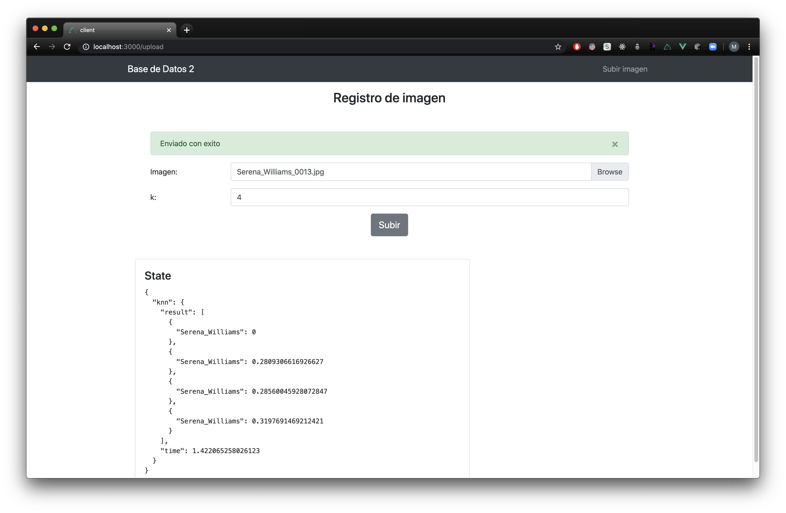

# Base de datos 2 - PC4

### Prerequisitos

Para macOS
```bash
brew install spatialindex
```

### Consideraciones para el knn-rtree

Borrar los archivos creados con las extensiones ```.dat``` y ```.idx```
cuando se realice una misma consulta por segunda vez

# Experimento 1


| Precision | ED | MD |
|-|-|-|
| K = 4 | 100% | 100% |
| K = 8 | 100% | 100% |
| K = 16 | 100% | 100% |

#### Evidencia

Serena_Williams_0013.jpg, k=4, ed:


Serena_Williams_0013.jpg, k=4, md:


Serena_Williams_0013.jpg, k=8, ed:


Serena_Williams_0013.jpg, k=8, md:


Serena_Williams_0013.jpg, k=16, ed:


Serena_Williams_0013.jpg, k=16, md:


# Experimento 2

| Tiempo | knn-rtree | knn-secuencial |
|-|-|-|
| N = 104 | 0.106 | 0.009 |
| N = 212 | 0.239 | 0.020 |
| N = 343 | 0.400 | 0.032 |
| N = 420 | 0.550 | 0.038 |
| N = 529 | 0.692 | 0.049 |
| N = 650 | 1.029 | 0.058 |

####Evidencia

k = 3

Serena_Williams_0013.jpg, n = 104:


Serena_Williams_0013.jpg, n = 212:


Serena_Williams_0013.jpg, n = 343:


Serena_Williams_0013.jpg, n = 420:


Serena_Williams_0013.jpg, n = 529:


Serena_Williams_0013.jpg, n = 650:


### Directorio ```utils/read_images.py```

Para la guardar los vectores caracteristicos de cada persona en
memoria secundaria y no tener que computar los encodings de las
imagenes otra vez. Estos archivos en memoria secuandaria tienen la extension
```.bin```.
